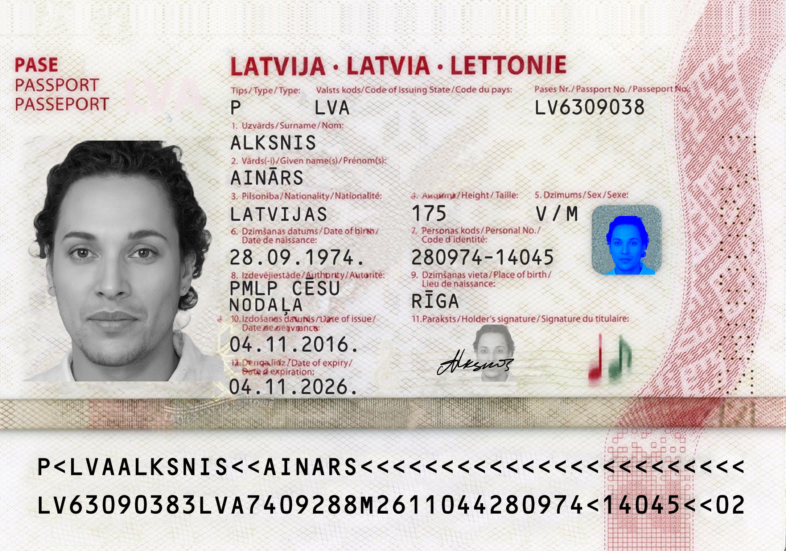
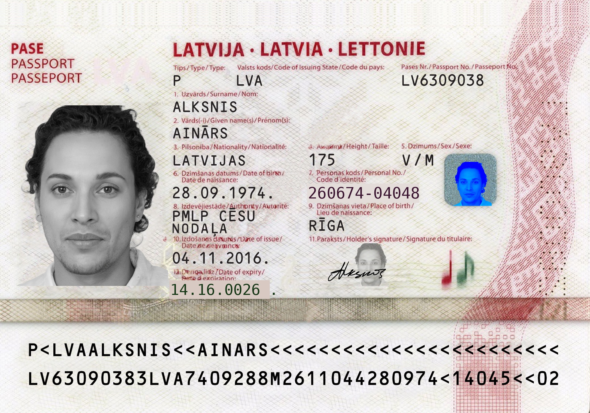
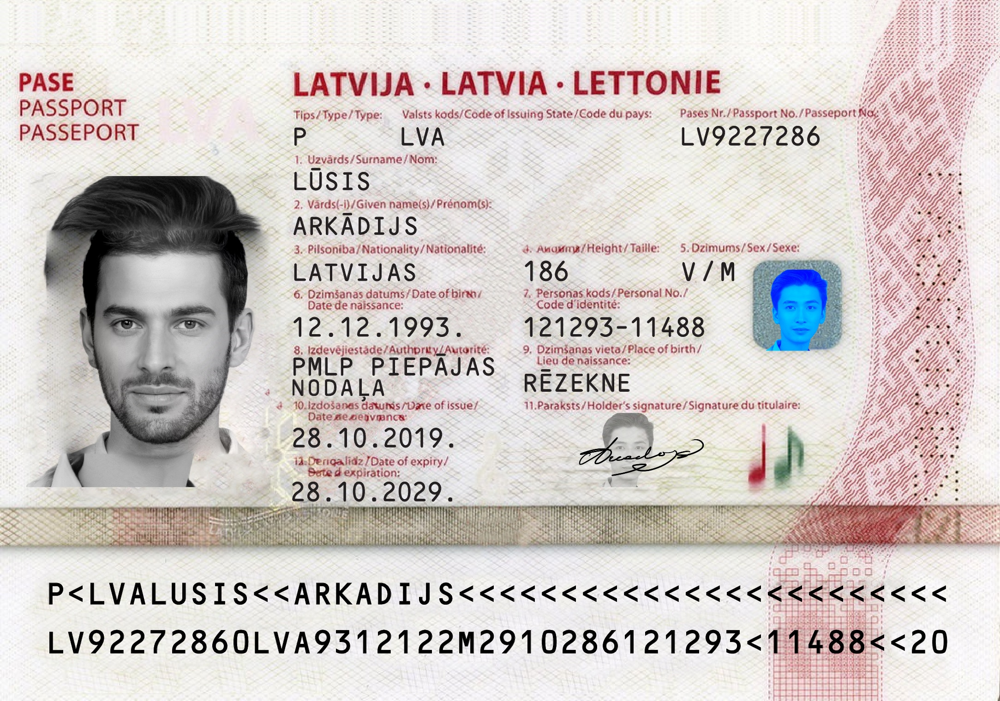
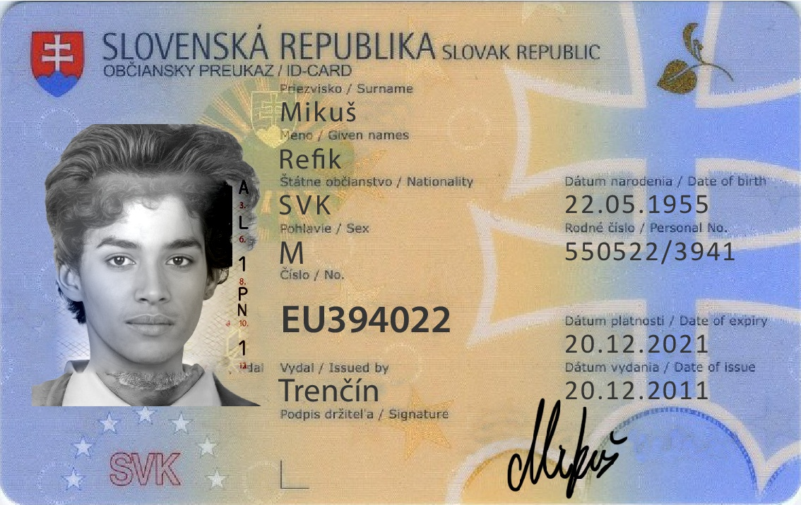

# Adversarially-Robust Identity Document Verification System

*(Working name — a real name gets picked once the system takes shape. Generic
package name for now: `doc_verification_system`.)*

A fine-tuned vision-language model system that extracts identity document fields,
detects and localizes tampering, reasons about risk in natural language, retrieves
similar past-flagged cases as supporting evidence, and recommends a risk-tiered
decision (auto-approve / auto-reject / human-review) under a configurable cost
tradeoff — with production benchmarking (fp16/INT8/INT4) reported alongside.

Built as a research-grade portfolio project: real fine-tuning (SFT + QLoRA, then
DPO), not API calls to a hosted model; every experiment reports sample sizes and
confidence intervals, not single-point accuracy; failures are documented, not
hidden.

**Status:** scaffolding complete (Phase 1). No trained model yet — see
[Build Status](#build-status) below.

## System Overview

```
LAYER 3: Operating System (monitoring, cost, drift)      [optional extension]
  LAYER 2: Decision Layer (risk tiers, cost tradeoff)
    LAYER 1: Detection Core (VLM, forgery, eval)
```

Layer 1 must be fully solid before Layer 2 starts; Layer 2 must work end to end
before Layer 3 (optional) is attempted.

## What it does

1. Extracts structured fields (name, DOB, ID number, address, expiry) as JSON
2. Detects whether the document is tampered/forged, and localizes where
3. Explains its reasoning in natural language
4. Retrieves similar past-flagged cases to support its verdict
5. Recommends a risk-tiered decision based on a configurable cost matrix
6. Reports its own production cost/latency tradeoffs at different quantization levels

## Core technical approach

- **Model:** Qwen2.5-VL-3B-Instruct, fine-tuned with QLoRA (4-bit) — originally
  targeted 7B; switched to 3B after real-Kaggle debugging surfaced an
  unresolved T4/library-stack training issue at 7B scale. **The Phase 3
  zero-shot baseline is still 7B and is kept as-is** — see
  [Model size: 3B trained, 7B baseline](#model-size-3b-trained-7b-baseline-a-documented-decision)
  below for the full reasoning and the comparison caveat this creates.
- **Training:** SFT for extraction + tamper detection, then DPO for explanation
  quality (chosen vs. rejected reasoning pairs)
- **Forgery generation:** 5 escalating tiers — field tampering, image splicing,
  diffusion-based inpainting, fully synthetic generation, recapture/moiré simulation
- **Core experiment:** leave-one-attack-tier-out generalization test across all 5
  tiers, with confidence intervals
- **Adversarial rounds:** 3 rounds of targeted retraining based on observed failure
  modes, with an accuracy curve tracked across rounds
- **Retrieval:** embedding-based similarity search (sentence-transformers) against
  past-flagged cases
- **Decision layer:** cost matrix (false-accept / false-reject / manual-review,
  reasoned assumptions, clearly labeled) driving a threshold sweep and cost curve
- **Production benchmarking:** fp16 vs. INT8 vs. INT4 — accuracy, latency, and
  estimated cost-per-verification at hypothetical volume

## Model size: 3B trained, 7B baseline (a documented decision)

The original plan (see `config/model_config.yaml`'s history) was to fine-tune
Qwen2.5-VL-**7B** throughout — largest VLM expected to fit QLoRA 4-bit
training on a 16GB T4 (Kaggle's free tier). That held up through the Phase 3
zero-shot baseline, which ran successfully on 7B and whose numbers are kept
as the reported baseline. It did not hold up for Phase 4 SFT training. The
real debugging chain, in order:

1. **Genuine OOM, fixed correctly (kernels v8-v10).** Backward-pass CUDA OOM,
   486MB then 1.7GB short. Each fix (capping an uncapped image resize, then
   `PYTORCH_CUDA_ALLOC_CONF=expandable_segments`, then reducing image
   size/LoRA rank further) visibly changed the exact shortfall — confirming
   these were real fixes for a real memory problem, not guesses.
2. **Once memory stopped being the constraint, training started silently
   hanging instead (kernels v11-v13).** Three different targeted fixes — a
   non-paged optimizer (ruling out paged-optimizer CPU paging as the cause),
   then `use_reentrant=False` on gradient checkpointing (targeting a
   documented deadlock class specific to QLoRA's frozen+trainable parameter
   mix) — each changed **where** the hang occurred rather than resolving it.
3. **That shifting-failure-point pattern is the actual evidence**, not one
   unlucky bug: three independent, well-reasoned fixes each addressing a
   different plausible cause, each producing a different hang location, is a
   stronger signal of a T4/library-stack compatibility issue in this specific
   environment than of one more fixable bug one config tweak away.

**Decision:** stop debugging 7B training and switch the SFT/DPO training
target to Qwen2.5-VL-**3B**-Instruct. Full details and exact kernel-by-kernel
numbers: [results/tables/phase4_sft_summary.md](results/tables/phase4_sft_summary.md).

**The comparison caveat this creates, stated plainly:** Phase 3's reported
zero-shot baseline (100% parse success, 88.9% tamper-verdict accuracy) is for
**7B**. Every subsequent fine-tuned result is for **3B**. Comparing them
conflates two effects — the fine-tuning gain, and a model-size difference —
and is not a clean ablation. Anywhere these numbers are compared (this
README, the results notebook, the final writeup), that conflation must be
flagged explicitly, not presented as if it were a same-model before/after.

## Compute

- Local dev (VS Code, CPU): all code, data generation, eval scripts, and the
  Streamlit app are written and smoke-tested on tiny samples here.
- Real GPU training (SFT, DPO, adversarial rounds) runs remotely on Kaggle's free
  tier (T4/P100, ~30 GPU-hrs/week) via the Kaggle CLI.
- Every training/eval script is config-driven (`config/training_config.yaml` ->
  `environment: local|kaggle`) so it runs identically either way — see
  `src/utils/config_utils.py`.

**Standing constraint, found in Phase 3, applies to every later phase:** this
dev machine has only ~7.7GB total RAM (often <1GB free at idle). That's not
just "slow for local inference" — attempting to load even Qwen2.5-VL-**3B** in
fp32 (~12-14GB) caused severe disk thrashing rather than graceful slowness, and
had to be killed. **No VLM loading, inference, or training happens locally on
this machine at all, at any model size or quantization level** — not just the
7B fine-tuning target, but even lightweight local "smoke tests" of model-loading
code must run on Kaggle instead. Local dev is scoped to logic that doesn't need
model weights in memory: data generation, config/manifest handling, metric
math, prompt/parsing logic, and Streamlit UI wiring — validated with unit tests
and mocked model outputs, not a real local forward pass. This is why Phase 3's
zero-shot baseline numbers come from a script that's tested-but-not-yet-executed
locally, with the real numbers deferred to a Kaggle run (see
[results/tables/phase3_baseline_summary.md](results/tables/phase3_baseline_summary.md)).

## Data

Public/synthetic only — **no real fraud data**. Base documents from MIDV-2020 (or
equivalent public ID dataset); all forgeries are generated, not sourced. Clearly
labeled throughout.

Phase 2 acquired a real (partial-download, local-dev-scale) MIDV-2020 sample and
ran Tier 1 (field tamper), Tier 2 (splicing), and the 5-kind degradation pipeline
against it end to end. See [results/tables/phase2_data_summary.md](results/tables/phase2_data_summary.md)
for exact counts, an example of a bug found and fixed mid-phase, and what scaling
up to a full run requires.

**Attribution:** MIDV-2020 (Bulatov et al., 2022, CC BY-SA 2.5) — synthetic faces
via [Generated Photos](https://generated.photos/). Dataset files themselves are
not committed to this repo (see `.gitignore`); `src/data_generation/acquire_dataset.py`
re-downloads them from the official source.

| Genuine | Tier 1: field tamper | Tier 2: splice (same code) | Tier 2: splice (cross code) |
|---|---|---|---|
|  |  |  |  |

See [results/sample_outputs/README.md](results/sample_outputs/README.md) for captions.

## Non-goals (explicit scope cuts, not oversights)

- No RL-based self-play forger — forgery generation is scripted/targeted (future
  work, see [writeup/project_report.md](writeup/project_report.md))
- No real fraud data sourcing
- No autonomous orchestrating agent layer — adversarial rounds are manually/scriptedly
  triggered
- Layer 3 (drift simulation, cost dashboard) is optional/extension, time-boxed
  behind Layers 1 and 2

## Repo layout

See folder tree in [writeup/project_report.md](writeup/project_report.md) methods
section once populated; for now, `src/` mirrors the system's layers
(`data_generation/`, `training/`, `retrieval/`, `eval/`, `decision/`, `monitoring/`),
`config/` holds all hyperparameters and cost assumptions, `results/` holds every
generated chart/table, `writeup/` holds the paper-style report.

## Setup

```bash
python -m venv venv
venv\Scripts\activate       # Windows; source venv/bin/activate on macOS/Linux
pip install -r requirements.txt
cp .env.example .env        # fill in HF_TOKEN / WANDB_API_KEY as needed
```

Kaggle CLI auth (only needed once you reach real GPU training in Phase 4+):
create an API token at kaggle.com/settings, place `kaggle.json` at
`~/.kaggle/kaggle.json` (or `%USERPROFILE%\.kaggle\kaggle.json` on Windows).

## Build Status

| Phase | What | Status |
|---|---|---|
| 1 | Scaffold (folders, configs, requirements, README) | Done |
| 2 | Data foundation (MIDV-2020, Tier 1-2 forgeries, degradation) | Done |
| 3 | Baselines (zero-shot VLM, OCR) | OCR done; VLM eval built + tested, real numbers deferred to Kaggle |
| 4 | Core SFT + QLoRA fine-tuning | In progress — 7B training hit an unresolved T4 hang after 3 targeted fixes (OOM resolved, then 2 hang variants); switched training target to 3B, see [Model size decision](#model-size-3b-trained-7b-baseline-a-documented-decision) |
| 5 | Forgery tiers 3-5 (inpainting, synthetic, recapture) | Tier 4/5 done; Tier 3 mask logic done, diffusion inference deferred to Kaggle |
| 6 | Core experiments (leave-one-out, adversarial rounds) | Orchestration/aggregation logic built + tested; real per-fold/per-round training deferred to Kaggle |
| 7 | Decision layer (risk tiering, cost matrix, cost-tradeoff sim, financial risk reasoning) | Risk-tiering + cost sim done, fully real (no model involved); financial risk reasoning not started (needs the fine-tuned model) — see [results/tables/phase6_7_groundwork_summary.md](results/tables/phase6_7_groundwork_summary.md) |
| 8 | DPO + retrieval | Retrieval (case_index.py) done, real end-to-end verified locally; DPO not started |
| 9 | Quantization benchmarking | Not started |
| 10 | Layer 3 (optional) | Not started |
| 11 | Demo + writeup | Not started |

Results, charts, and the full paper-style writeup will be embedded here as each
phase completes.
